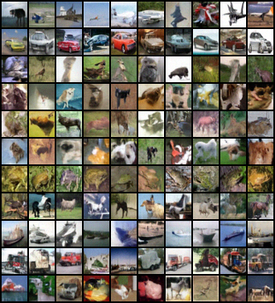
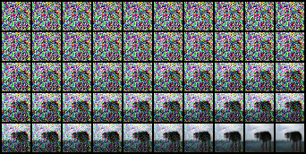

# Diffusion Transformer (DiT) improved
1. Use Xpos instead of sinusoid positional embeddings
2. Use more efficient time+condition injection in [PixArt-α](https://github.com/PixArt-alpha/PixArt-alpha/tree/master)
3. Use "register" tokens https://arxiv.org/abs/2309.16588
4. Use DeepSeek MoE https://arxiv.org/abs/2401.06066
# TODO:
1. Use masked training objective
2. Use smooth latent space https://arxiv.org/abs/2312.04410
# Run
Run `cifar10_dit.py`
# Samples
From bs=256 step=156k

